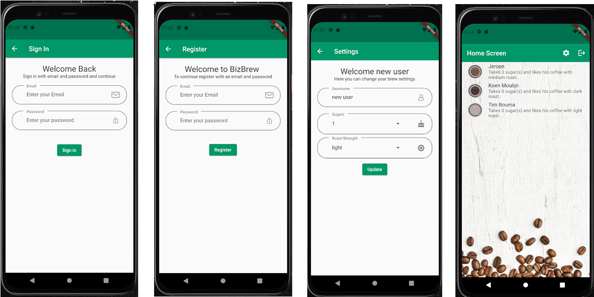

# Biz Brew
A Flutter Firebase project for my internship.

## Overview

This project is a starting point for developing a Flutter Firebase application.
The application is to view the coffee preferences of your colleagues. 
Beside viewing your colleagues preferences you can set your own preference coupled with your own account.


## Technologies

- Dart SDK 2.13.0 (stable)
- Flutter Framework 2.2.0 (beta)

#### Dependancies
- firebase_auth: ^1.0.0
- firebase_firestore: ^1.0.0
- firebase_core: ^1.0.0
- connectivity: ^3.0.0
  
## Features

- Display coffee preferences
- Register coffee preferencences of the employees
  - Number of sugars
  - Coffee strength
  - Milk or no milk (new)
- Firebase Firestore database
- Firebase Authentication
- Password Reset (new)
- Connectivity control (new)

#### To Do:
- Have an user be able to delete his account
- Send messages to user that it's time to get coffee 
- Transform the architecture to BLoC
- Use Firebase to add chat to your app
- Enable users to share latte art photos

## Gettings Started

Before getting started, this project assumes you are able to create a Flutter project and also have an active Firebase project. if you do not meet these prerequisites, follow the links below:

- [Getting Started with Flutetr](https://flutter.dev/docs/get-started/install)
- [Create a firebase project](https://console.firebase.google.com/)
- [Lab: Write your first Flutter app](https://flutter.dev/docs/get-started/codelab)
- [Cookbook: Useful Flutter samples](https://flutter.dev/docs/cookbook)

For help getting started with Flutter, view the
[online documentation](https://flutter.dev/docs), which offers tutorials,
samples, guidance on mobile development, and a full API reference.
For getting started with Firebase, view the 
[online documention](https://firebase.google.com/docs/firestore).
Combined documentation for working with Flutter and Firebase, view
[FlutterFire](https://firebase.flutter.dev/). FlutterFire is a set of flutter plugins wich connnect your Flutter application to [Firebase](https://firebase.google.com/). If you new to using Firebase in Flutter I recommend starting with the _Get to know Firebase for Flutter_ [Codelab](https://firebase.google.com/codelabs/firebase-get-to-know-flutter#0).


## Setup

Setup your project.

```
git clone https://github.com/Baqiwaqi/Biz_Brew.git
cd project
flutter pub get
flutter run
```
Setup Firebase project.

Start with the [overview](https://firebase.flutter.dev/docs/overview) on the 
flutterfire website. Then do a [codelab](https://firebase.google.com/codelabs/firebase-get-to-know-flutter) on the Google Platform. The Codelab will teach you
how to setup a firebase project.

## Project Status

The Project status is for now _done_. The project was intended to only for my internship projetc. But I had so much fun developing in Flutterperhaps I start developing again on this project. Currently I am working onather porject. So the project is _on hold_.

## Documentation

- [PvE](documentation/markdown/PvE.md)
- [Functioneel Ontwerp](documentation/markdown/functioneel_ontwerp.md)  
- [Kerntaak 3](documentation/markdown/kerntaak_3.md)
- [kerntaak P1-K1](documentation/markdown/P1-K1.md)
  